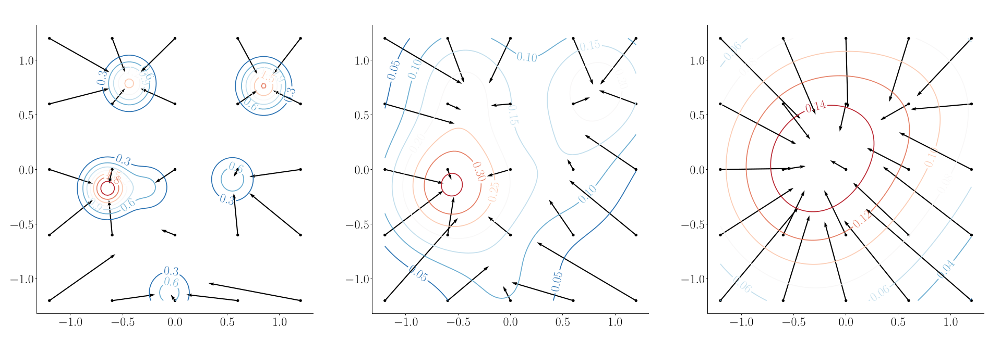

# Product of Gaussian Mixture Diffusion Models
This repository contains training and evaluation code of [Product of Gaussian Mixture Diffusion Models](https://arxiv.org/abs/2310.12653).
It depends on the cuda implementation of the [LogSumExp potential and activation function](https://github.com/VLOGroup/logsumexp#logsumexp-activation-function).

The following table establishes how to recreate the plots in the paper:
| Figure(s)    | File(s) |
| -------- | ------- |
| 1  | dirac    |
| 2 | ---     |
| 3 and 14    | draw    |
| 4    | draw_wavelets    |
| 5 and 6    | draw_shearlets    |
| 7    | compute_shearlet_approx    |
| 8 and 9 and Tab. 1    | denoise    |
| 10    | noise_estimation    |
| 11    | noise_estimation_image    |
| 12    | generate-analytical and draw_generated    |
| 13    | studentt_diffusion_approx |
